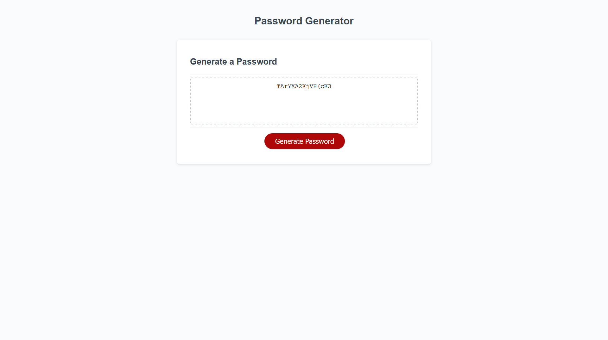

# Description

In this assignment, our task was to create a random password generator that runs in the browser and is powered by vanilla Javascript.

When the user selects "Generate Password", a prompt displays asking them how many characters the password should be - it's required the password length must be between 8-128 characters.

Once the user choose the length of their password, they're meet with additional prompts on if they'd like to include lowercase, uppercase, numeric, and/or special characters in their password - it's required that one character type must be selected.

# Screenshot

# Link

(https://eriksvetlik.github.io/passwordgenerator/)
